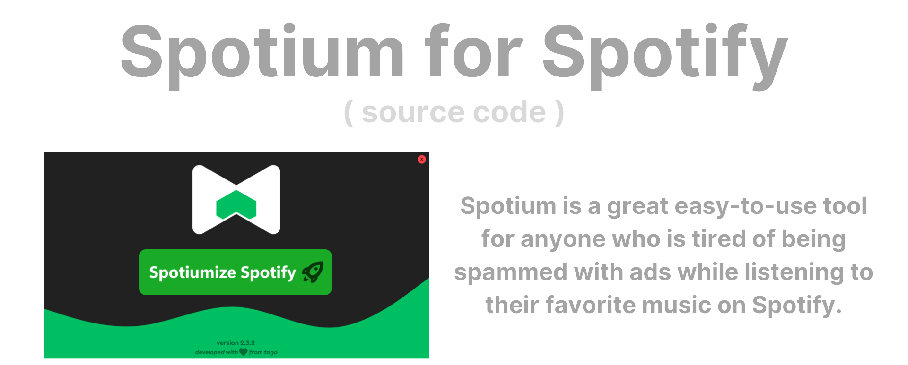

<div align="center">
    </a>
    <br />

   
   

   *there is definitely an easier way to make a tkinter menu but idc*

</div>

Spotium does not include any viruses, backdoors, trojans, or any other type of malicious software or code. Additionally, Spotium rarely updates but when it does it is important, Spotium checks for updates automatically. You can view the latest Spotium files VirusTotal result for windows and for macOS. Spotium has gone to macOS thanks to some inspiration from [BlockTheSpot](https://github.com/Nuzair46/BlockTheSpot-Mac/tree/main). Spotium has gone open source to further prove that there are no viruses, and to allow the community to contribute. 

# Compile to app 🧑‍💻

1. Download py2app
   ```sh
   pip install py2app
   ```
   
2. Convert py to macos app
   ```sh
   python setup.py py2app
   ```

# License & Information 📃
This project is published under the [Apache License Version 2.0 License](./LICENSE)

If you are interested in working together, or want to get in contact with me please email me at santiagobuisnessmail@gmail.com
